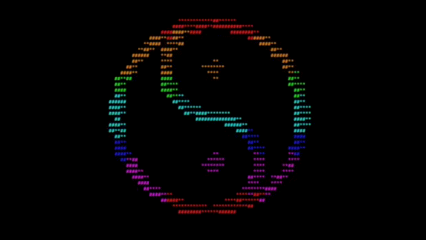
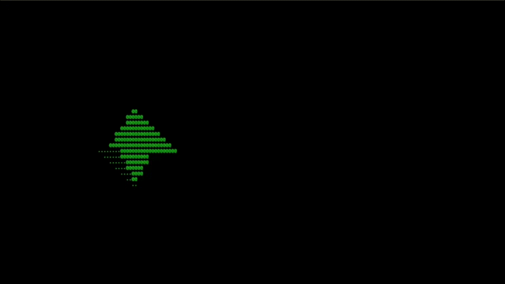

# parTTYcles

## Clone

```
git clone 
git submodule init
git submodule update
```

## Build

```
make clean
make
```

## Run-time Preparation

Run a broker with a corresponding message generator.
You can use, e.g., [bowerick](https://github.com/ruedigergad/bowerick) (download from dist/) and run it as follows:

```
java -jar dist/bowerick-2.8.0-standalone.jar -G yin-yang -I 40 -u '[tcp://127.0.0.1:1031 mqtt://127.0.0.1:1701 ws://127.0.0.1:1864 stomp://127.0.0.1:2000]'
```

This command will start a message broker and a message generator that publishes messages with content that can be displayed by parTTYcles.

## Run

```
./parTTYcles
```

Using the above example of message generation via bowerick, the output should look as follows:



## Alternative Message Generation

parTTYcles should be able to connect to any MQTT broker.
The most important aspect is that messages with the appropriate content are published.

One way for providing a corresponding generic broker is to use bowerick without a message generator as follows:

```
java -jar dist/bowerick-2.8.0-standalone.jar -u '[tcp://127.0.0.1:1031 mqtt://127.0.0.1:1701 ws://127.0.0.1:1864 stomp://127.0.0.1:2000]'
```

Other brokers should work as well.

### Message Generation via curl

A single message can be sent via curl as follows:

```
curl -d '[{"x": 0.0, "y": 0.0, "z": 0.0, "scale_x": 2.0, "scale_y": 2.0, "scale_z": 2.0, "color_r": 0.0, "color_g": 1.0, "color_b": 0.0}]' mqtt://localhost:1701/bowerick/message/generator
```

Below is a simple example for sending a stream of messages:

```
while true ;
do
    for i in $(seq -1 0.1 1);
    do
        curl -d '[{"x": '${i}', "y": 0.0, "z": 0.0, "scale_x": 2.0, "scale_y": 2.0, "scale_z": 2.0, "color_r": 0.0, "color_g": 1.0, "color_b": 0.0}]' mqtt://localhost:1701/bowerick/message/generator
        sleep 0.1s ;
    done ;
done
```

With the above example, the output should look as follows:



## License

parTTYcles is licensed under the terms of the MIT license.
See also "LICENSE.txt".

### Dependencies

parTTYcles depends on the following projects:

- TermGL (Copyright (c) 2021 Wojciech Graj)
  Licensed under the terms of the MIT license.
- MQTT-C (Liam Bindle)
  Licensed under the terms of the MIT license.
- json-parser (Copyright (C) 2012, 2013 James McLaughlin et al.)
  Licensed under the terms of a BSD 2-Clause "Simplified" License.

